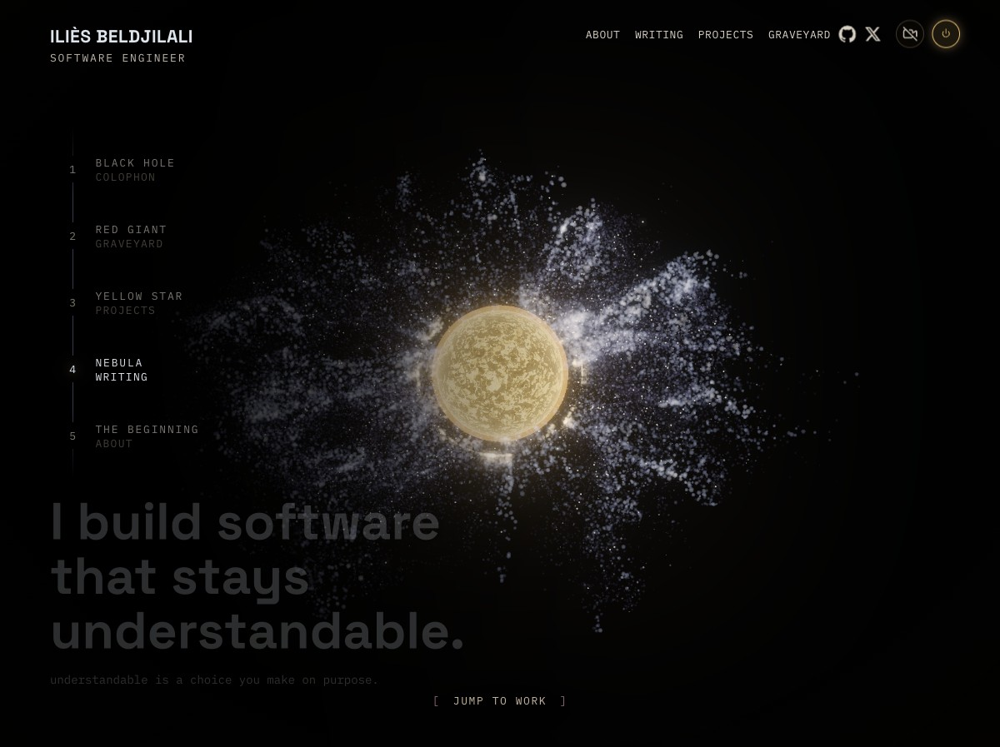
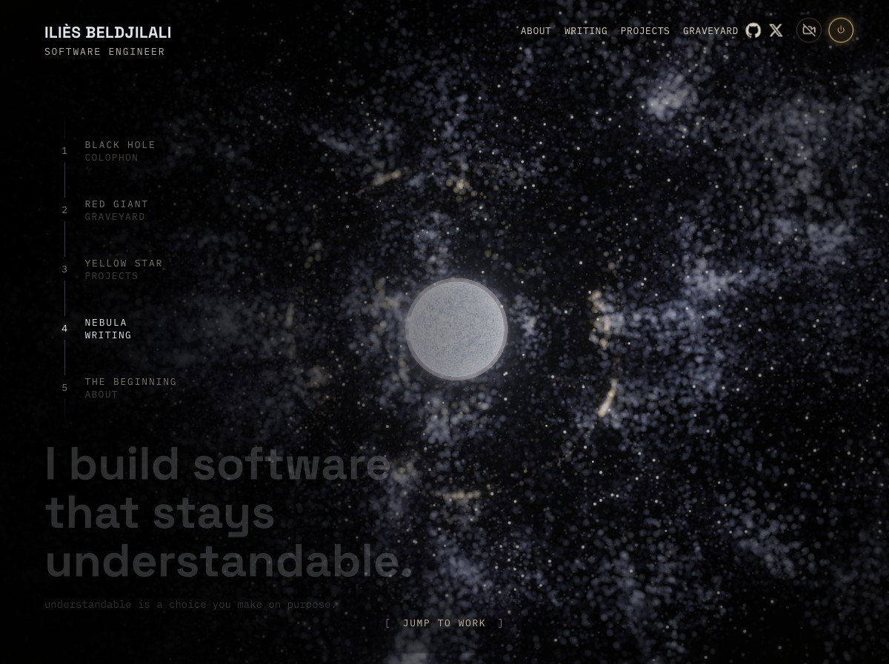
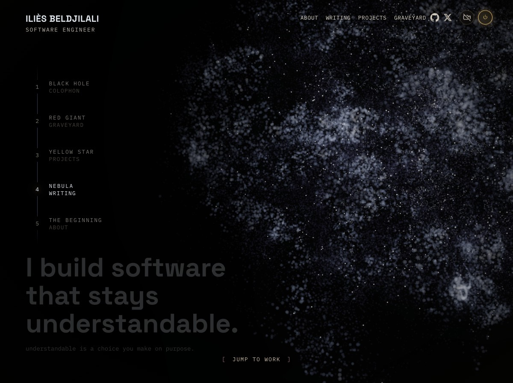

# Hero star glossary

The hero (`src/hero/BlackHole.tsx`) plays the stellar lifecycle **in reverse** as
you scroll. The word "sun" is overloaded in the code: it names both **lifecycle
states** (things on the timeline) and **renderers** (the machinery that draws
them). This glossary pins down each term with the actual rendered image and the
code that produces it, so we stop conflating "the yellow star", "the red giant",
and "the sun".

There are **two distinct axes** — keep them separate:

- **State** = where you are on the scroll timeline (black hole → … → pale blue dot).
- **Renderer** = which system draws the pixels (the GPU **point cloud**, or the
  dedicated **mesh sun rig**).

The same recipe (Ashima simplex-noise photosphere) appears in *both* renderers,
which is why "sun" got reused everywhere.

---

## States (scroll timeline)

Scroll height is 6 viewport-tall stages; scroll progress maps to a fractional
`stage` (0..5). `window.__bhMorph = N` force-sets the stage for inspection.

| stage | state              | renderer            | image |
|-------|--------------------|---------------------|-------|
| 0     | **black hole**     | point cloud         | [black-hole.png](./black-hole.png) |
| 1     | reverse supernova  | point cloud         | — |
| 2     | **red giant**      | point cloud         | [red-giant.png](./red-giant.png) |
| 3     | **yellow star**    | **mesh sun rig**    | [yellow-star.png](./yellow-star.png) |
| 4     | **nebula**         | point cloud         | [nebula-3.05-formed.jpeg](./nebula-3.05-formed.jpeg) · [3.25](./nebula-3.25-collapsing.jpeg) · [3.50](./nebula-3.50-dispersed.jpeg) |
| 5     | pale blue dot      | point cloud (placeholder) | — |

State labels live in the `BEATS` array (`state: 'red giant'` at line ~2567,
`state: 'yellow star'` at line ~2574).

---

### Black hole — `stage 0`

The hero. Photon ring + lensed accretion disk, drawn by the **point cloud**
(`diskVertexShader` / `diskFragmentShader`). Top of the page.

---

### Reverse supernova — `stage 1`

The brief, blinding transition between the red giant and the black hole. Its look
is **not** drawn by the point cloud's body shader — it is a screen-space
post-pass, `NovaShader` (`src/hero/shaders/post.glsl.ts`), composited *after* the
grade. It is keyed to the `nova` envelope (a clockless Gaussian in `stage`,
centred on `NOVA_CENTER = 0.62`, computed in `createScene.ts` and passed through
`lifecycle()`), so the whole blast is deterministic and reversible — scrolling
back up replays it exactly, scrolling down mirrors it (`uNovaDir`).

The pass layers two things over the graded frame:

- a restrained central **whiteout bloom** (`front` × 0.28 + `coreBloom`) — the
  detonation flash, pulled way down so it no longer washes the disk flat,
- an expanding **inclined gas shock disk** (`uShock`): a turbulent ring of
  incandescent gas lying in a flat plane **tilted in 3D toward the camera**, so it
  reads in PERSPECTIVE — the near (lower) rim large & open, the far (upper) rim
  compressed & converging (Saturn-rings look), receding into the frame rather than
  a flat oval. The screen point is mapped onto that plane via a closed-form
  perspective warp: vertical foreshortened by `sin(uShockDeg)` then a perspective
  divide keyed to screen height (`uShockPersp` sets the near/far asymmetry);
  `uShockWide` widens the lateral span. 5-octave fbm drives the clumpy gas,
  advected outward over `uTime`; a fiery palette maps it deep ember-red (cool
  outer rim) → burnt orange → amber → hot rose core, composited as emitted light.
  An in-plane **roll** (`uShockRoll`, degrees) slants the disk's long axis
  diagonally across the frame (a clock-hand rotation) rather than dead horizontal.
  The shock radius leads the envelope (`pow(ringE, 0.6)`) so the disk sweeps
  outward; on the implode side it contracts. `uShock = 0` disables the disk.
  Tuning knobs: `uShockRoll` (diagonal slant), `uShockDeg` (foreshorten),
  `uShockPersp` (3D tilt strength), `uShockWide` (lateral spread), `uShock`
  (intensity).

The point cloud underneath is doing its own physical shock-breakout (the disk
shader's `uFlash` glow, driven by `look.flash`); the gas disk is the
*screen-space* companion that reads as the headline beat.

---

### Red giant — `stage 2`

Big, bloated, deep-red mottled sphere. Drawn by the **point cloud** using the
ported Ashima-noise photosphere recipe.

- **Renderer:** point cloud (`diskVertexShader`, the `if(sunOn > 0.5)` block,
  line ~469).
- **Palette:** `vSunRed = 1` → the red-giant ramp in the fragment (deep
  maroon → blood-red → red-orange, never gold/white).
- **Radius:** `sunRadFac = 1.45` (line ~473) — bloated.
- **Activity:** `atmoThresh = 0.955` — *few* coronal loops/prominences (a red
  giant is cool and magnetically quiet).
- In code the red-giant case is the `redGiant` flag:
  `float redGiant = (uYellow < 0.5 && uNebula < 0.5 && uDot < 0.5)` (line ~467).

---

### Yellow star — `stage 3`

Tighter, hotter, gold sun-like star with a bright corona and visible
prominences/flares licking off the limb. This is the **only** state drawn by the
dedicated **mesh sun rig**, not the point cloud.

- **Renderer:** mesh **sun rig** — `buildSunRig()` (definition line ~1499;
  `interface SunRig` line ~1485; instance `const sunRig = buildSunRig(...)` line
  ~2153). It is a solid photosphere mesh + inner glow + corona billboard +
  animated loop/prominence Points.
- **Radius:** `SUN_RIG_RADIUS = 4.2 * 0.92` (line ~2152).
- **Swap-in:** the rig is revealed and the point cloud hidden only during the
  yellow slot: `const sunWindow = !!yellow && !nebula` →
  `sunRig.group.visible = sunWindow; diskPrimary.visible = !sunWindow`
  (lines ~2302–2305). This is a **hard swap at stage 2.5**, not a morph.

> Note: the point cloud *can also* render a yellow sun (`vSunRed = 0`,
> `sunRadFac = 0.92`, more flares via `atmoThresh = 0.91`) — that path is the
> original placeholder. On the current timeline the **mesh sun rig** is what you
> actually see for the yellow star; the point-cloud yellow path is dormant.

---

### Nebula — `stage 4`

Scrolling **down** the page, the yellow star sheds its gas: the photosphere
disperses into a cloud of particles that thins and spreads until no central body
remains. These three frames read the lifecycle in its natural scroll order
(formed → collapsing → dispersed):

| `stage 3.05` — formed | `stage 3.25` — collapsing | `stage 3.50` — dispersed |
|---|---|---|
|  |  |  |
| star intact, gas bursting outward | gas condensing toward a faint core | diffuse cloud, no central body |

- **Renderer:** **point cloud** (same `diskVertexShader` / `diskFragmentShader`
  as the red giant), gated on by `uNebula`. In `lifecycle()` the gate is
  `nebula = stage >= NEBULA_ACTIVE_STAGE` (`NEBULA_ACTIVE_STAGE = 3.5`,
  `sceneTable.ts`); `nebulaShader` (→ `uNebula`) stays on through the collapse
  floor crossfade so the cloud never reverts to the shader's red-giant default.
- **Settled hold:** the dispersed cloud rests around **stage 3.42**, with the
  marker window `[3.38, 3.50]` (the `settledWindow` on the nebula segment in
  `sceneTable.ts`).
- **The collapse is the reverse beat.** The three frames above run in *scroll*
  order, but the code's first-class motion is the **reverse** (scrolling **up**,
  nebula → yellow star): a GPGPU **gravitational collapse** across
  stage 3.5 (dispersed) → 3.05 (fully-fed star). Its drivers, all pure functions
  of `stage` (`lifecycle.ts`, the *nebula → yellow star* block):
  - `collapse` (→ `uCollapseDrive`) — the GPGPU well/spring; `pow(prog, 0.85)`,
    LEADS the star so the gas piles onto the core *before* the star reaches size.
  - `simBlend` (→ `uSimBlend`) — morphs the disk from the analytic nebula
    placement to the baked sim positions; ramps to full `1.0` by the floor so the
    gas actually vacuums into the core instead of a dispersed cloud lingering.
  - `starFormed` — mesh-star reveal `pow(prog, 1.5)`, lags the gas so the inflow
    visibly feeds a growing core.
  - `cloudBright` — cloud brightness across the collapse (bright infall → fade).
  - Window constants `NEB_COLLAPSE_HI` (3.5) / `NEB_COLLAPSE_LO` (3.0) live in
    `sceneTable.ts`; everything is hard-gated to `[LO, HI]` so stages below the
    window don't wrongly turn the red giant / yellow star into "collapsing nebula".
- **Hyperspace exit:** continuing down toward the pale blue dot, the nebula's own
  particles smear into radial starlines (`streak` → `uStreak`) over the dezoom.

> The old `point cloud (placeholder)` note for this state is stale — the nebula is
> a real, sim-driven beat now, not a stand-in.

---

## Renderers (the two ways a star is drawn)

| renderer | what it is | draws | key code |
|----------|-----------|-------|----------|
| **point cloud** | the ~1.2M-point GPU particle system | black hole, reverse supernova, **red giant**, nebula, dot | `diskVertexShader` / `diskFragmentShader` |
| **mesh sun rig** | a solid mesh + glow + corona + animated loop Points | **yellow star** only | `buildSunRig()` (~1499) |

Both use the **Ashima simplex-noise** photosphere recipe — that shared recipe is
the reason "sun" leaked into so many names.

---

## Naming cheat-sheet (current code)

| code identifier | meaning |
|---|---|
| `redGiant` (shader var, ~467) | the point-cloud sun is in **red-giant** mode |
| `sunOn` (shader var, ~468) | the point-cloud sun (red giant *or* yellow) is active |
| `vSunRed` (varying) | palette select: **1 = red giant**, **0 = gold/yellow** |
| `sunRadFac` (shader, ~473) | star radius factor: **1.45 red giant**, **0.92 yellow** |
| `atmoThresh` (shader) | flare density gate: **0.955 red giant** (few), **0.91 yellow** (more) |
| `sunRig` / `buildSunRig` / `SunRig` | the **mesh** yellow-star renderer |
| `SUN_RIG_RADIUS` (~2152) | the mesh sun rig's radius |
| `sunWindow` (frame loop, ~2302) | true only during the yellow-star slot (rig shown, cloud hidden) |
| `uYellow` / `yellow` | drives the yellow state (uniform / JS flag) |

---

_Images regenerated with `scratchpad/shoot-glossary.mjs` (forces `__bhMorph` per
state and crops the star). Line numbers are approximate — grep the identifier if
they have drifted._
