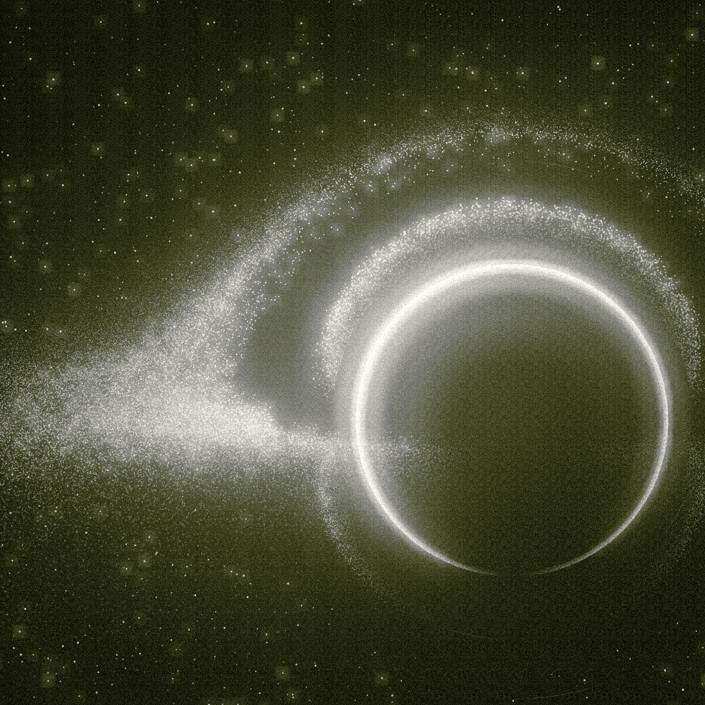
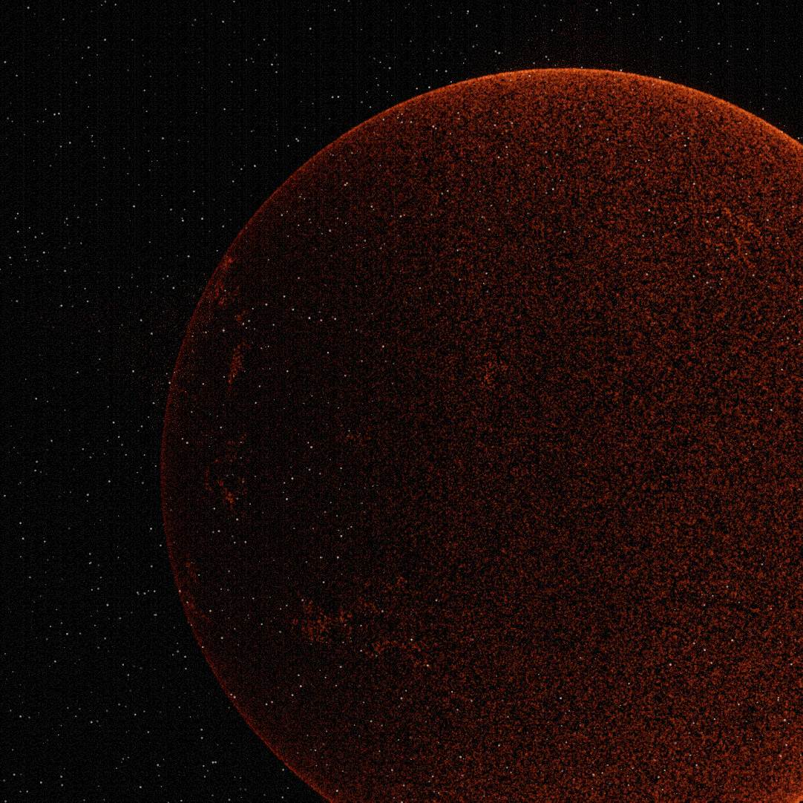
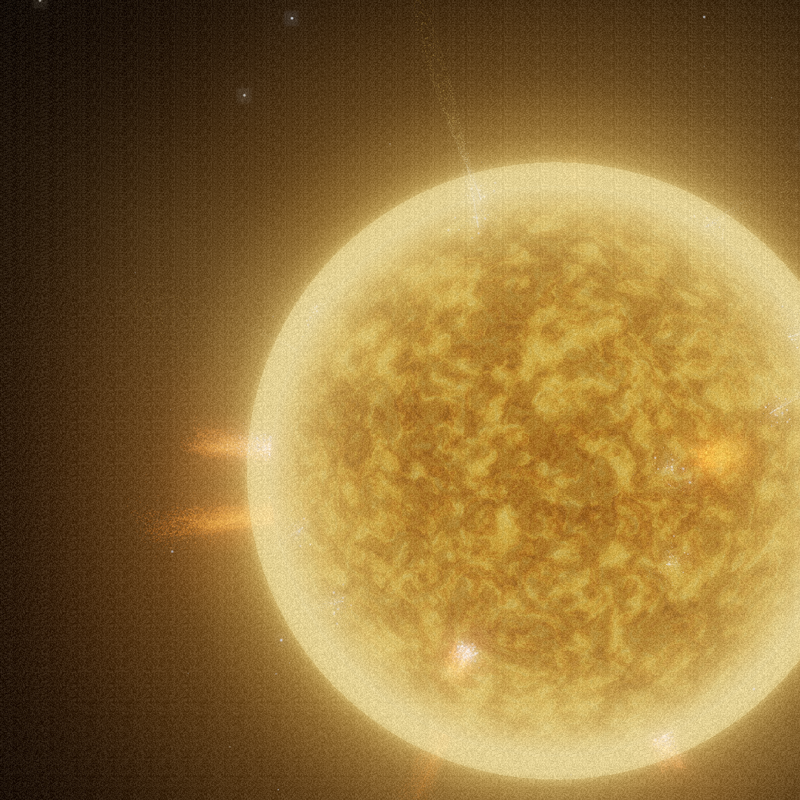

# Hero star glossary

The hero (`src/hero/BlackHole.tsx`) plays the stellar lifecycle **in reverse** as
you scroll. The word "sun" is overloaded in the code: it names both **lifecycle
states** (things on the timeline) and **renderers** (the machinery that draws
them). This glossary pins down each term with the actual rendered image and the
code that produces it, so we stop conflating "the yellow star", "the red giant",
and "the sun".

There are **two distinct axes** — keep them separate:

- **State** = where you are on the scroll timeline (black hole → … → pale blue dot).
- **Renderer** = which system draws the pixels (the GPU **point cloud**, or the
  dedicated **mesh sun rig**).

The same recipe (Ashima simplex-noise photosphere) appears in *both* renderers,
which is why "sun" got reused everywhere.

---

## States (scroll timeline)

Scroll height is 6 viewport-tall stages; scroll progress maps to a fractional
`stage` (0..5). `window.__bhMorph = N` force-sets the stage for inspection.

| stage | state              | renderer            | image |
|-------|--------------------|---------------------|-------|
| 0     | **black hole**     | point cloud         | [black-hole.png](./black-hole.png) |
| 1     | reverse supernova  | point cloud         | — |
| 2     | **red giant**      | point cloud         | [red-giant.png](./red-giant.png) |
| 3     | **yellow star**    | **mesh sun rig**    | [yellow-star.png](./yellow-star.png) |
| 4     | nebula             | point cloud (placeholder) | — |
| 5     | pale blue dot      | point cloud (placeholder) | — |

State labels live in the `BEATS` array (`state: 'red giant'` at line ~2567,
`state: 'yellow star'` at line ~2574).

---

### Black hole — `stage 0`

The hero. Photon ring + lensed accretion disk, drawn by the **point cloud**
(`diskVertexShader` / `diskFragmentShader`). Top of the page.

---

### Red giant — `stage 2`

Big, bloated, deep-red mottled sphere. Drawn by the **point cloud** using the
ported Ashima-noise photosphere recipe.

- **Renderer:** point cloud (`diskVertexShader`, the `if(sunOn > 0.5)` block,
  line ~469).
- **Palette:** `vSunRed = 1` → the red-giant ramp in the fragment (deep
  maroon → blood-red → red-orange, never gold/white).
- **Radius:** `sunRadFac = 1.45` (line ~473) — bloated.
- **Activity:** `atmoThresh = 0.955` — *few* coronal loops/prominences (a red
  giant is cool and magnetically quiet).
- In code the red-giant case is the `redGiant` flag:
  `float redGiant = (uYellow < 0.5 && uNebula < 0.5 && uDot < 0.5)` (line ~467).

---

### Yellow star — `stage 3`

Tighter, hotter, gold sun-like star with a bright corona and visible
prominences/flares licking off the limb. This is the **only** state drawn by the
dedicated **mesh sun rig**, not the point cloud.

- **Renderer:** mesh **sun rig** — `buildSunRig()` (definition line ~1499;
  `interface SunRig` line ~1485; instance `const sunRig = buildSunRig(...)` line
  ~2153). It is a solid photosphere mesh + inner glow + corona billboard +
  animated loop/prominence Points.
- **Radius:** `SUN_RIG_RADIUS = 4.2 * 0.92` (line ~2152).
- **Swap-in:** the rig is revealed and the point cloud hidden only during the
  yellow slot: `const sunWindow = !!yellow && !nebula` →
  `sunRig.group.visible = sunWindow; diskPrimary.visible = !sunWindow`
  (lines ~2302–2305). This is a **hard swap at stage 2.5**, not a morph.

> Note: the point cloud *can also* render a yellow sun (`vSunRed = 0`,
> `sunRadFac = 0.92`, more flares via `atmoThresh = 0.91`) — that path is the
> original placeholder. On the current timeline the **mesh sun rig** is what you
> actually see for the yellow star; the point-cloud yellow path is dormant.

---

## Renderers (the two ways a star is drawn)

| renderer | what it is | draws | key code |
|----------|-----------|-------|----------|
| **point cloud** | the ~1.2M-point GPU particle system | black hole, reverse supernova, **red giant**, nebula, dot | `diskVertexShader` / `diskFragmentShader` |
| **mesh sun rig** | a solid mesh + glow + corona + animated loop Points | **yellow star** only | `buildSunRig()` (~1499) |

Both use the **Ashima simplex-noise** photosphere recipe — that shared recipe is
the reason "sun" leaked into so many names.

---

## Naming cheat-sheet (current code)

| code identifier | meaning |
|---|---|
| `redGiant` (shader var, ~467) | the point-cloud sun is in **red-giant** mode |
| `sunOn` (shader var, ~468) | the point-cloud sun (red giant *or* yellow) is active |
| `vSunRed` (varying) | palette select: **1 = red giant**, **0 = gold/yellow** |
| `sunRadFac` (shader, ~473) | star radius factor: **1.45 red giant**, **0.92 yellow** |
| `atmoThresh` (shader) | flare density gate: **0.955 red giant** (few), **0.91 yellow** (more) |
| `sunRig` / `buildSunRig` / `SunRig` | the **mesh** yellow-star renderer |
| `SUN_RIG_RADIUS` (~2152) | the mesh sun rig's radius |
| `sunWindow` (frame loop, ~2302) | true only during the yellow-star slot (rig shown, cloud hidden) |
| `uYellow` / `yellow` | drives the yellow state (uniform / JS flag) |

---

_Images regenerated with `scratchpad/shoot-glossary.mjs` (forces `__bhMorph` per
state and crops the star). Line numbers are approximate — grep the identifier if
they have drifted._
